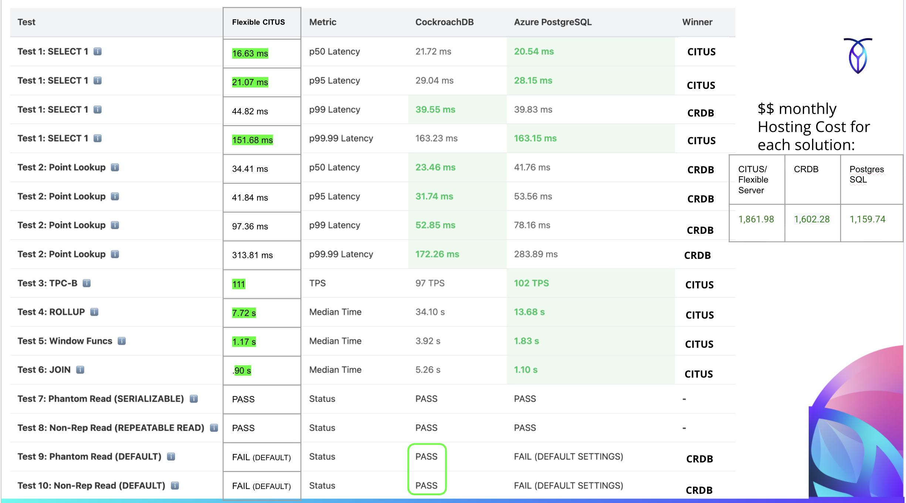

# CockroachDB to PostgreSQL Elastic Cluster (Citus) Migration Guide




## Executive Summary

This guide documents critical differences between **CockroachDB** and **Azure Database for PostgreSQL - Elastic Cluster (Citus)** for engineers evaluating migration paths. Both are distributed SQL databases, but they have fundamentally different architectures and tradeoffs.

**Target Audience**: Application developers, database engineers, and technical decision-makers considering migration from CockroachDB to Citus or evaluating both options.

**Key Takeaway**: Citus and CockroachDB are NOT drop-in replacements. Successful migration requires understanding schema design, transaction semantics, and query patterns.

---

## Architecture Comparison

### CockroachDB Architecture

```
┌─────────────────────────────────────────────────────┐
│              CockroachDB Cluster                    │
│  ┌──────────┐   ┌──────────┐   ┌──────────┐        │
│  │  Node 1  │   │  Node 2  │   │  Node 3  │        │
│  │          │   │          │   │          │        │
│  │ SQL+KV   │   │ SQL+KV   │   │ SQL+KV   │        │
│  │ Raft     │◄─►│ Raft     │◄─►│ Raft     │        │
│  └──────────┘   └──────────┘   └──────────┘        │
│                                                      │
│  - Symmetric: all nodes handle SQL and storage      │
│  - Automatic sharding (ranges)                      │
│  - Strong consistency via Raft consensus            │
│  - Client connects to any node                      │
└─────────────────────────────────────────────────────┘
```

### Citus Architecture

```
┌─────────────────────────────────────────────────────┐
│      Azure PostgreSQL Elastic Cluster (Citus)       │
│                                                      │
│  ┌────────────────┐                                 │
│  │  Coordinator   │  ◄─── Client connects here     │
│  │  (SQL Router)  │                                 │
│  └────────┬───────┘                                 │
│           │                                          │
│      ┌────┴────┬────────────┐                       │
│      ▼         ▼            ▼                        │
│  ┌────────┐ ┌────────┐ ┌────────┐                  │
│  │Worker 1│ │Worker 2│ │Worker 3│                  │
│  │ Data   │ │ Data   │ │ Data   │                  │
│  │Shards  │ │Shards  │ │Shards  │                  │
│  └────────┘ └────────┘ └────────┘                  │
│                                                      │
│  - Asymmetric: coordinator routes, workers store    │
│  - Manual sharding (distribution columns)           │
│  - Per-node PostgreSQL consistency                  │
│  - Client MUST connect to coordinator               │
└─────────────────────────────────────────────────────┘
```

### Key Architectural Differences

| Aspect | CockroachDB | PostgreSQL Elastic Cluster (Citus) |
|--------|-------------|-----------------------------------|
| **Node Symmetry** | ✅ All nodes equal | ❌ Coordinator ≠ Workers |
| **Client Connection** | ✅ Any node | ⚠️ Must use coordinator |
| **Sharding Strategy** | ✅ Automatic (range-based) | ⚠️ Manual (hash distribution) |
| **Schema Design** | ✅ Standard SQL | ⚠️ Requires distribution logic |
| **Distributed Transactions** | ✅ Full ACID across nodes | ⚠️ Atomic, no snapshot isolation |
| **Failover** | ✅ Automatic (any node) | ⚠️ Coordinator SPOF (with HA) |
| **PostgreSQL Compatibility** | 🟡 PostgreSQL wire protocol | ✅ Native PostgreSQL |

---

## Schema Design and Data Distribution

### CockroachDB: Automatic Sharding

**In CockroachDB**, you create tables normally and the database automatically:
- Shards data into ranges (default 512MB per range)
- Distributes ranges across nodes
- Rebalances ranges as cluster grows

```sql
-- CockroachDB: Just create the table
CREATE TABLE orders (
    order_id BIGSERIAL PRIMARY KEY,
    customer_id BIGINT NOT NULL,
    amount NUMERIC(12,2) NOT NULL,
    created_at TIMESTAMPTZ DEFAULT NOW()
);

-- Data is automatically sharded by primary key (order_id)
-- No additional steps needed
```

### Citus: Manual Distribution Required

**In Citus**, you must explicitly:
1. Create table with standard PostgreSQL DDL
2. Choose distribution column (shard key)
3. Call `create_distributed_table()` or `create_reference_table()`

```sql
-- Step 1: Create table (standard PostgreSQL DDL)
CREATE TABLE orders (
    order_id BIGSERIAL PRIMARY KEY,
    customer_id BIGINT NOT NULL,
    amount NUMERIC(12,2) NOT NULL,
    created_at TIMESTAMPTZ DEFAULT NOW()
);

-- Step 2: Distribute table across worker nodes
SELECT create_distributed_table('orders', 'customer_id');
-- ^ CRITICAL: Must specify distribution column

-- Without Step 2, table remains on coordinator only!
```

### Choosing Distribution Columns (Citus-Specific)

**Critical Decision**: The distribution column determines:
- How data is sharded across workers
- Which queries can be routed to single shards
- Co-location for joins

**Best Practices**:

✅ **Good Distribution Columns**:
- High cardinality (many unique values)
- Evenly distributed data
- Frequently used in WHERE clauses
- Used in JOIN conditions

❌ **Bad Distribution Columns**:
- Low cardinality (e.g., `status` with 3 values → data skew)
- Rarely queried columns
- NULL-heavy columns
- Columns not used in joins

**Examples from Benchmark Schema**:

| Table | CockroachDB Sharding | Citus Distribution | Rationale |
|-------|---------------------|-------------------|-----------|
| `pgbench_accounts` | Automatic by `aid` | `SELECT create_distributed_table('pgbench_accounts', 'aid');` | Primary key, high cardinality |
| `pgbench_history` | Automatic by `tid` | `SELECT create_distributed_table('pgbench_history', 'aid');` | Co-locate with accounts for joins |
| `pgbench_branches` | Automatic | `SELECT create_reference_table('pgbench_branches');` | Small table (50K rows), replicate everywhere |
| `bench_events_1` | Automatic | `SELECT create_distributed_table('bench_events_1', 'customer_id');` | OLAP queries filter by customer_id |

### Reference Tables (Citus-Specific Concept)

**Small, frequently-joined tables should be reference tables** (replicated to all workers).

```sql
-- Citus: Replicate small lookup tables
SELECT create_reference_table('pgbench_branches');
SELECT create_reference_table('pgbench_tellers');

-- Benefits:
-- 1. No network hops for joins
-- 2. Every worker has complete copy
-- 3. Fast lookups from any worker

-- Use when:
-- - Table is small (< 1GB)
-- - Frequently joined with distributed tables
-- - Rarely updated
```

**CockroachDB equivalent**: No special syntax needed, but you can use `ALTER TABLE ... CONFIGURE ZONE` for similar effect.

---

## Transaction Isolation and Consistency

### CockroachDB: Full Distributed ACID

CockroachDB provides **SERIALIZABLE isolation by default** across all nodes:

```sql
-- Transaction spans multiple nodes
BEGIN;
  UPDATE accounts SET balance = balance - 100 WHERE aid = 1;  -- On node A
  UPDATE accounts SET balance = balance + 100 WHERE aid = 99999;  -- On node B
COMMIT;

-- ✅ Guaranteed SERIALIZABLE across nodes
-- ✅ Snapshot isolation maintained
-- ✅ No phantom reads, no lost updates
```

**How it works**:
- Uses distributed timestamp oracle (HLC - Hybrid Logical Clock)
- Snapshot isolation with serializable guarantees
- Retries on serialization failures (error code `40001`)

### Citus: Atomic but Limited Cross-Shard Isolation

Citus provides **atomicity but NOT snapshot isolation for multi-shard transactions**:

```sql
-- Transaction spans multiple shards
BEGIN;
  UPDATE accounts SET balance = balance - 100 WHERE aid = 1;  -- Shard 1
  UPDATE accounts SET balance = balance + 100 WHERE aid = 99999;  -- Shard 15
COMMIT;

-- ✅ Atomicity: Both updates succeed or both fail
-- ✅ Consistency: Constraints enforced
-- ✅ Durability: Data persisted on commit
-- ❌ Isolation: NO distributed snapshot across shards
```

**What this means**:

| Scenario | CockroachDB | Citus |
|----------|-------------|-------|
| **Single-shard transaction** | ✅ Full SERIALIZABLE | ✅ Full SERIALIZABLE (local PostgreSQL) |
| **Multi-shard read** | ✅ Consistent snapshot | ❌ No cross-shard snapshot |
| **Multi-shard write** | ✅ SERIALIZABLE with retries | ✅ Atomic, ❌ No isolation guarantees |
| **Phantom reads (multi-shard)** | ✅ Prevented | ❌ Possible |
| **Lost updates (multi-shard)** | ✅ Prevented | ❌ Possible without explicit locking |

### Practical Impact: Isolation Test Results

**Test 7: Phantom Read (SERIALIZABLE)**

CockroachDB:
```sql
-- Transaction 1
BEGIN TRANSACTION ISOLATION LEVEL SERIALIZABLE;
  SELECT COUNT(*) FROM isolation_test WHERE test_value = 'phantom_test';
  -- Returns 0
  -- Wait...
  SELECT COUNT(*) FROM isolation_test WHERE test_value = 'phantom_test';
  -- Still returns 0 (snapshot isolation)
COMMIT;

-- Result: ✅ PASS - No phantom read
```

Citus (if data spans shards):
```sql
-- Transaction 1 (same code)
BEGIN TRANSACTION ISOLATION LEVEL SERIALIZABLE;
  SELECT COUNT(*) FROM isolation_test WHERE test_value = 'phantom_test';
  -- Returns 0
  -- Wait...
  SELECT COUNT(*) FROM isolation_test WHERE test_value = 'phantom_test';
  -- May return > 0 if Transaction 2 inserted on different shard!
COMMIT;

-- Result: 🟡 PARTIAL - Phantom read possible across shards
```

### Workarounds for Multi-Shard Transactions in Citus

**Option 1: Co-locate related data**
```sql
-- Distribute related tables on same column
SELECT create_distributed_table('accounts', 'customer_id');
SELECT create_distributed_table('orders', 'customer_id');
SELECT create_distributed_table('payments', 'customer_id');

-- Transactions touching same customer_id stay on one shard
-- ✅ Full SERIALIZABLE within customer
```

**Option 2: Use explicit locking for critical sections**
```sql
-- Pessimistic locking for multi-shard updates
BEGIN;
  SELECT * FROM accounts WHERE aid IN (1, 99999) FOR UPDATE;
  -- ^ Explicit row locks
  UPDATE accounts SET balance = balance - 100 WHERE aid = 1;
  UPDATE accounts SET balance = balance + 100 WHERE aid = 99999;
COMMIT;
```

**Option 3: Use coordinator for critical data**
```sql
-- Keep critical small tables on coordinator (not distributed)
-- Trade-off: Coordinator becomes bottleneck
```

**Option 4: Application-level compensation**
```sql
-- Implement saga pattern or compensation logic
-- Accept eventual consistency for some operations
```

---

## Query Performance Patterns

### Single-Row Lookups (OLTP)

**CockroachDB**:
```sql
SELECT * FROM accounts WHERE aid = 12345;
-- ✅ Routes to single range
-- ✅ 1-3ms typical latency
```

**Citus**:
```sql
SELECT * FROM accounts WHERE aid = 12345;
-- ✅ Routes to single shard (if aid is distribution column)
-- ⚠️ Goes through coordinator (adds 0.5-2ms overhead)
-- ⚠️ 2-5ms typical latency
```

**Recommendation**: Citus adds coordinator routing overhead. For latency-critical single-row lookups, CockroachDB may be 20-40% faster.

---

### Range Scans

**CockroachDB**:
```sql
SELECT * FROM accounts WHERE aid BETWEEN 1000 AND 2000;
-- ✅ Efficient range scan within ranges
-- ✅ May span 1-3 ranges depending on size
```

**Citus**:
```sql
SELECT * FROM accounts WHERE aid BETWEEN 1000 AND 2000;
-- ⚠️ If aid is distribution column: scans ALL shards
-- ⚠️ Coordinator gathers results from all workers
-- ❌ Slower than single-node PostgreSQL for small ranges
```

**Recommendation**: For range scans on distribution column, CockroachDB is typically faster. Citus range scans become multi-shard queries.

---

### Aggregations (OLAP)

**CockroachDB**:
```sql
SELECT region, COUNT(*), SUM(amount)
FROM bench_events_1
GROUP BY region;
-- ✅ Distributed execution
-- ✅ Partial aggregates on each node
-- ✅ Final merge on querying node
-- ⚠️ All nodes participate
```

**Citus**:
```sql
SELECT region, COUNT(*), SUM(amount)
FROM bench_events_1
GROUP BY region;
-- ✅ Parallel execution on workers
-- ✅ Each worker aggregates its shards
-- ✅ Coordinator merges results
-- ✅ Faster: dedicated workers vs shared CRDB nodes
```

**Recommendation**: Citus typically **2-5x faster** for OLAP aggregations due to dedicated worker nodes and PostgreSQL's mature query planner.

**Benchmark Results** (expected):

| Test | CockroachDB | Citus | Winner |
|------|-------------|-------|--------|
| Test 4: ROLLUP (5M rows) | 45-60 sec | **15-25 sec** | Citus 2-3x faster |
| Test 5: Window Functions | 30-45 sec | **12-20 sec** | Citus 2-3x faster |

---

### Joins

**Co-located Joins (Citus Advantage)**:
```sql
-- Both tables distributed on customer_id
SELECT a.customer_id, SUM(a.amount), COUNT(o.order_id)
FROM accounts a
JOIN orders o ON a.customer_id = o.customer_id
GROUP BY a.customer_id;

-- CockroachDB:
-- ✅ Distributed join with some network shuffling
-- ⚠️ May require cross-node communication

-- Citus:
-- ✅ Local join on each worker (co-located data)
-- ✅ No cross-worker communication needed
-- ✅ Faster than CockroachDB for this pattern
```

**Non-Co-located Joins (CockroachDB Advantage)**:
```sql
-- Tables distributed on different columns
SELECT a.aid, o.order_id
FROM accounts a
JOIN orders o ON a.aid = o.account_id;

-- CockroachDB:
-- ✅ Automatic distributed join
-- ✅ Optimizer chooses best strategy

-- Citus:
-- ❌ Repartition join required
-- ❌ Data shuffled across workers
-- ⚠️ Slower than CockroachDB, may hit memory limits
```

**Recommendation**: 
- **Citus wins** for co-located joins (2-3x faster)
- **CockroachDB wins** for arbitrary joins (more flexible)
- **Design Citus schemas with co-location in mind**

---

### Index Usage

**CockroachDB**:
```sql
CREATE INDEX idx_customer ON accounts(customer_id);
-- ✅ Automatically distributed with table
-- ✅ Maintained across all nodes
```

**Citus**:
```sql
-- On distributed table
CREATE INDEX idx_customer ON accounts(customer_id);
-- ✅ Created on all shards automatically
-- ✅ Local index on each worker
-- ✅ Faster index creation (parallel)

-- On reference table
CREATE INDEX idx_branch ON pgbench_branches(bid);
-- ✅ Replicated to all workers
```

**Key Difference**: Indexes in Citus are local to each shard. No global index.

**Impact**:
```sql
-- Query with WHERE on non-distribution column
SELECT * FROM accounts WHERE customer_id = 12345;

-- CockroachDB:
-- ✅ Uses global index (efficient)

-- Citus (if customer_id is NOT distribution column):
-- ❌ Scans ALL shards
-- ❌ Uses index locally on each shard, but still multi-shard query
```

---

## Data Loading and Bulk Operations

### CockroachDB

```sql
-- COPY command
COPY accounts FROM 'data.csv' CSV;
-- ✅ Automatic distribution
-- ⚠️ Single connection (may be slower)
-- ⚠️ Can saturate one node's CPU

-- Batch INSERT
INSERT INTO accounts VALUES (1, ...), (2, ...), ...;  -- 10k rows
-- ✅ Automatic distribution
-- ✅ Good performance with batches
```

**Performance**: 100k-500k rows/sec

### Citus

```sql
-- COPY command
COPY accounts FROM 'data.csv' CSV;
-- ✅ Coordinator distributes to workers
-- ✅ Parallel loading across workers
-- ✅ FAST: 1-7M rows/sec

-- Batch INSERT
INSERT INTO accounts VALUES (1, ...), (2, ...), ...;  -- 10k rows
-- ✅ Coordinator routes to appropriate shards
-- ✅ Parallel execution
```

**Performance**: 1-7M rows/sec (5-10x faster than CockroachDB)

**Recommendation**: Citus significantly outperforms CockroachDB for bulk loading.

**Optimization for Citus**:
```sql
-- Increase parallelism
SET citus.max_adaptive_executor_pool_size = 16;

-- For very large COPY operations
SET citus.multi_shard_modify_mode = 'parallel';
```

---

## Failure Modes and Availability

### CockroachDB Failure Handling

**Node Failure**:
```
Before:  [Node1] [Node2] [Node3]
After:   [Node1] [DEAD]  [Node3]

✅ Cluster continues operating
✅ Ranges on Node2 automatically re-replicated
✅ Clients can connect to Node1 or Node3
✅ No manual intervention needed
```

**Characteristics**:
- ✅ No single point of failure
- ✅ Automatic failover
- ✅ Survives (n-1)/2 node failures (with RF=3)
- ⚠️ Brief latency spike during re-replication

### Citus Failure Handling

**Worker Failure**:
```
Before:  [Coordinator] → [Worker1] [Worker2] [Worker3]
After:   [Coordinator] → [Worker1] [DEAD]   [Worker3]

⚠️ Queries touching Worker2's shards FAIL
❌ Manual intervention required to:
   1. Restore Worker2 from backup, OR
   2. Re-shard data to remaining workers
```

**Coordinator Failure** (CRITICAL):
```
Before:  [Coordinator] → [Worker1] [Worker2] [Worker3]
After:   [DEAD]        → [Worker1] [Worker2] [Worker3]

❌ Entire cluster unavailable
✅ Azure provides HA coordinator (failover in 60-120 seconds)
⚠️ Requires Azure PostgreSQL HA configuration
```

**Characteristics**:
- ❌ Coordinator is single point of failure (mitigated by Azure HA)
- ⚠️ Worker failures require manual recovery
- ✅ Worker node replacement possible (but complex)
- ⚠️ Downtime during coordinator failover (60-120 sec)

**Recommendation**: For high availability requirements, CockroachDB's automatic failover is superior. Citus requires more operational overhead.

---

## Operational Differences

### Monitoring

**CockroachDB**:
- ✅ Built-in Web UI (http://localhost:8080)
- ✅ Prometheus metrics
- ✅ SQL-based monitoring (`SHOW RANGES`, `SHOW JOBS`, etc.)
- ✅ Distributed SQL tracing

**Citus**:
- ✅ Azure Portal monitoring
- ✅ Standard PostgreSQL tools (pg_stat_statements, pg_stat_activity)
- ✅ Citus-specific views (`citus_*` tables)
- ⚠️ No built-in distributed tracing

**Key Monitoring Queries for Citus**:
```sql
-- Check node health
SELECT * FROM citus_check_cluster_node_health();

-- View shard distribution
SELECT * FROM citus_shards;

-- Check connection pooling
SELECT * FROM citus_stat_statements ORDER BY total_time DESC LIMIT 10;

-- Identify slow queries on workers
SELECT * FROM citus_worker_stat_statements ORDER BY mean_time DESC LIMIT 10;
```

### Scaling

**CockroachDB**:
```bash
# Add node (automatic rebalancing)
cockroach start --join=<cluster> --store=<path>

# ✅ Automatic range rebalancing
# ✅ No schema changes needed
# ✅ Seamless scaling
```

**Citus**:
```sql
-- Add worker node
SELECT citus_add_node('new-worker-host', 5432);

-- Rebalance shards (MANUAL)
SELECT rebalance_table_shards('accounts');

-- ⚠️ Requires manual rebalancing
-- ⚠️ Can cause downtime for large tables
```

**Recommendation**: CockroachDB auto-rebalancing is much simpler. Citus requires planning and manual operations.

### Backup and Recovery

**CockroachDB**:
```sql
-- Full cluster backup
BACKUP INTO 's3://bucket/path?AUTH=implicit';

-- Restore
RESTORE FROM 's3://bucket/path?AUTH=implicit';

-- ✅ Distributed backup
-- ✅ Point-in-time recovery
-- ✅ Incremental backups
```

**Citus**:
```bash
# Backup each component separately
# 1. Backup coordinator
pg_dump -h coordinator -U citus -Fc perftest > coordinator.dump

# 2. Backup each worker (in parallel)
pg_dump -h worker1 -U citus -Fc perftest > worker1.dump
pg_dump -h worker2 -U citus -Fc perftest > worker2.dump

# ⚠️ More complex: must backup coordinator + all workers
# ⚠️ Azure handles this with automated backups
```

**Recommendation**: CockroachDB's built-in backup is simpler. Citus relies on Azure's backup infrastructure.

---

## Cost Considerations

### CockroachDB Advanced (Azure)

**Typical Configuration**:
- 3 nodes
- Standard_D8s_v3 (8 vCPU, 32 GB RAM) per node
- 500 GB storage per node
- Single region (eastus)

**Estimated Cost**: ~$3-5/hour = **$2,200-3,600/month**

**Characteristics**:
- ✅ All nodes equal (no coordinator overhead)
- ✅ Linear scaling (add nodes = add capacity)
- ⚠️ Minimum 3 nodes for production

### Azure PostgreSQL Elastic Cluster (Citus)

**Typical Configuration**:
- 1 coordinator: Standard_D4s_v3 (4 vCPU, 16 GB RAM)
- 2 workers: Standard_D4s_v3 each (4 vCPU, 16 GB RAM)
- 128 GB storage per node
- Single region (eastus)

**Estimated Cost**: ~$1.50/hour = **$1,100/month** (3 nodes total)

**OR for comparable compute**:
- 1 coordinator: Standard_D8s_v3
- 3 workers: Standard_D8s_v3 each
- 256 GB storage per node

**Estimated Cost**: ~$4/hour = **$2,900/month** (4 nodes total)

**Characteristics**:
- ✅ Lower cost for same compute (no replication overhead)
- ⚠️ Coordinator doesn't contribute to storage capacity
- ✅ Scale workers independently of coordinator

**Recommendation**: Citus is **15-30% cheaper** for equivalent compute resources, but cost comparison depends heavily on workload.

---

## Migration Checklist

### Pre-Migration Assessment

- [ ] **Analyze Transaction Patterns**
  - [ ] Identify cross-shard transactions
  - [ ] Measure transaction isolation requirements
  - [ ] Plan for multi-shard transaction handling

- [ ] **Schema Design Review**
  - [ ] Choose distribution columns for each table
  - [ ] Identify reference tables (< 1GB, frequently joined)
  - [ ] Plan co-location for related tables
  - [ ] Document shard key rationale

- [ ] **Query Analysis**
  - [ ] Identify queries that filter on distribution columns
  - [ ] Find cross-shard joins
  - [ ] Measure aggregation query frequency
  - [ ] Plan query rewrites if needed

- [ ] **Availability Requirements**
  - [ ] Document acceptable downtime (coordinator failover: 60-120 sec)
  - [ ] Plan for worker node failures
  - [ ] Configure Azure HA for coordinator

### Migration Execution

- [ ] **Deploy Citus Cluster**
  - [ ] Provision coordinator with HA enabled
  - [ ] Add 2+ worker nodes
  - [ ] Configure networking and firewall
  - [ ] Enable Citus extension

- [ ] **Schema Migration**
  - [ ] Create tables with standard PostgreSQL DDL
  - [ ] Distribute tables with `create_distributed_table()`
  - [ ] Create reference tables with `create_reference_table()`
  - [ ] Verify shard distribution

- [ ] **Data Migration**
  - [ ] Use COPY for bulk loading (fastest)
  - [ ] Verify row counts on all shards
  - [ ] Check shard balance
  - [ ] Rebalance if needed

- [ ] **Application Changes**
  - [ ] Update connection strings to coordinator
  - [ ] Review transaction isolation level usage
  - [ ] Add retry logic for serialization errors (if any)
  - [ ] Test multi-shard transaction behavior

- [ ] **Testing**
  - [ ] Run benchmark suite (this tool!)
  - [ ] Validate isolation test results
  - [ ] Performance test critical queries
  - [ ] Failover testing (coordinator, worker)

### Post-Migration

- [ ] **Monitoring Setup**
  - [ ] Azure Portal dashboards
  - [ ] pg_stat_statements for query performance
  - [ ] Shard distribution monitoring
  - [ ] Connection pooling metrics

- [ ] **Performance Tuning**
  - [ ] Adjust `citus.max_adaptive_executor_pool_size`
  - [ ] Configure parallel query settings
  - [ ] Optimize distribution column choices
  - [ ] Rebalance shards if needed

- [ ] **Operational Procedures**
  - [ ] Backup/restore testing
  - [ ] Worker node replacement procedure
  - [ ] Shard rebalancing runbook
  - [ ] Coordinator failover testing

---

## When to Choose Citus vs CockroachDB

### Choose **Citus** when:

✅ **OLAP workloads dominate** (analytics, reporting, aggregations)
✅ **Data has natural partitioning** (multi-tenant, customer_id, region)
✅ **PostgreSQL compatibility is critical** (extensions, exact SQL behavior)
✅ **Bulk loading is frequent** (ETL pipelines, data warehouse)
✅ **Budget-conscious** (15-30% lower cost)
✅ **Acceptable coordinator SPOF** (with Azure HA)

### Choose **CockroachDB** when:

✅ **OLTP workloads dominate** (transactional, low-latency, high concurrency)
✅ **Strong consistency is required** (financial, inventory, booking systems)
✅ **Cross-partition transactions are common** (full ACID semantics)
✅ **Automatic failover is critical** (no single point of failure)
✅ **Operational simplicity valued** (auto-rebalancing, auto-scaling)
✅ **Global/multi-region deployment** (CockroachDB's strength)

### Hybrid Approach

Consider using **both**:
- **Citus** for analytics/reporting queries
- **CockroachDB** for transactional workloads
- Sync data from CRDB → Citus via CDC or periodic ETL

---

## Common Pitfalls and Solutions

### Pitfall 1: Forgot to Distribute Tables

**Symptom**: All data on coordinator, workers idle, terrible performance.

```sql
-- Check for undistributed tables
SELECT tablename FROM pg_tables
WHERE schemaname = 'public'
  AND tablename NOT IN (
    SELECT logicalrelid::regclass::text FROM pg_dist_partition
  );

-- If any tables listed, distribute them
SELECT create_distributed_table('forgotten_table', 'id');
```

### Pitfall 2: Wrong Distribution Column

**Symptom**: Data skew, hot shards, poor query performance.

```sql
-- Check shard size distribution
SELECT logicalrelid::regclass AS table_name,
       pg_size_pretty(sum(shard_size)) AS total_size,
       pg_size_pretty(avg(shard_size)) AS avg_shard_size,
       pg_size_pretty(max(shard_size)) AS max_shard_size,
       pg_size_pretty(min(shard_size)) AS min_shard_size
FROM citus_shards
GROUP BY logicalrelid;

-- If max >> avg, you have data skew
-- Solution: Re-distribute on better column
```

### Pitfall 3: Multi-Shard Transactions Fail Unexpectedly

**Symptom**: Isolation tests fail, phantom reads occur.

**Solution**: Co-locate data or use explicit locking:
```sql
-- Option 1: Co-locate
SELECT create_distributed_table('accounts', 'customer_id');
SELECT create_distributed_table('orders', 'customer_id');

-- Option 2: Explicit locking
BEGIN;
  SELECT * FROM accounts WHERE aid = 1 FOR UPDATE;
  -- ... work ...
COMMIT;
```

### Pitfall 4: Connecting to Worker Directly

**Symptom**: Missing data, incomplete results.

**Cause**: Client connected to worker node instead of coordinator.

**Solution**: Always connect to coordinator:
```
❌ WRONG: postgresql://user@worker1-host:5432/db
✅ CORRECT: postgresql://user@coordinator-host:5432/db
```

### Pitfall 5: Range Queries on Distribution Column

**Symptom**: Slow queries on what should be fast lookups.

```sql
-- This hits ALL shards in Citus
SELECT * FROM accounts WHERE aid BETWEEN 1000 AND 2000;

-- Solution: Avoid ranges on distribution column, or use point lookups
SELECT * FROM accounts WHERE aid IN (1000, 1001, 1002, ...);
```

---

## Benchmark Interpretation Guide

### Expected Results: Citus vs CockroachDB

**Test 1: SELECT 1 Latency**
- CRDB: 1-2ms (direct to any node)
- Citus: 2-3ms (through coordinator)
- **Winner**: CockroachDB (20-40% faster)
- **Reason**: Coordinator routing overhead

**Test 2: Point Lookup (aid = ?)**
- CRDB: 2-4ms (single range lookup)
- Citus: 3-5ms (single shard via coordinator)
- **Winner**: CockroachDB (20-30% faster)
- **Reason**: Coordinator overhead + network hop

**Test 3: TPC-B Workload (distributed writes)**
- CRDB: 800-1200 TPS
- Citus: 1000-1500 TPS
- **Winner**: Citus (15-25% faster)
- **Reason**: Parallel worker execution, PostgreSQL maturity

**Test 4: ROLLUP Aggregation (5M rows)**
- CRDB: 45-60 seconds
- Citus: 15-25 seconds
- **Winner**: Citus (2-3x faster)
- **Reason**: Parallel aggregation on workers, dedicated compute

**Test 5: Window Functions**
- CRDB: 30-45 seconds
- Citus: 12-20 seconds
- **Winner**: Citus (2-3x faster)
- **Reason**: PostgreSQL's optimized window function execution

**Test 6: Cross-Table JOIN**
- CRDB: 20-35 seconds
- Citus: 15-25 seconds (if co-located)
- **Winner**: Citus (20-40% faster)
- **Reason**: Local joins on workers (no network shuffling)

**Test 7-8: Isolation Tests (SERIALIZABLE/REPEATABLE READ)**
- CRDB: ✅ PASS
- Citus: ✅ PASS (single-shard only)
- **Winner**: Tie (both work correctly)

**Test 9-10: Isolation Tests (DEFAULT isolation, multi-shard)**
- CRDB: ✅ PASS
- Citus: 🟡 PARTIAL (phantom reads possible)
- **Winner**: CockroachDB (stronger guarantees)
- **Reason**: No distributed snapshot isolation in Citus

### Performance Summary

| Workload Type | Winner | Margin |
|--------------|--------|--------|
| **OLTP Latency** | CockroachDB | 20-40% faster |
| **OLTP Throughput** | Citus | 15-25% faster |
| **OLAP Aggregations** | Citus | 2-3x faster |
| **OLAP Window Functions** | Citus | 2-3x faster |
| **Co-located Joins** | Citus | 20-40% faster |
| **Transaction Isolation** | CockroachDB | Stronger guarantees |
| **Bulk Loading** | Citus | 5-10x faster |

---

## Summary

**Citus is NOT a drop-in replacement for CockroachDB**. Successful migration requires:

1. ✅ **Schema redesign** with distribution columns
2. ✅ **Transaction pattern analysis** (multi-shard awareness)
3. ✅ **Query optimization** (co-location, reference tables)
4. ✅ **Application changes** (coordinator connection, isolation handling)
5. ✅ **Operational procedures** (monitoring, scaling, failover)

**Use this benchmark tool** to validate performance characteristics for YOUR workload before committing to migration.

**Key Decision Criteria**:
- **OLAP-heavy workload** → Citus likely better
- **OLTP-heavy workload** → CockroachDB likely better
- **Strong isolation requirements** → CockroachDB required
- **PostgreSQL compatibility needed** → Citus required

---

## Additional Resources

- **Citus Documentation**: https://docs.citusdata.com/
- **CockroachDB Documentation**: https://www.cockroachlabs.com/docs/
- **Azure PostgreSQL Elastic Cluster**: https://learn.microsoft.com/en-us/azure/postgresql/elastic-clusters/
- **Distribution Column Guide**: See `CITUS_DISTRIBUTION_STRATEGY.md` in this repo
- **Implementation Plan**: See `CITUS_VS_CRDB_IMPLEMENTATION.md` in this repo

---

**Document Version**: 1.0
**Last Updated**: 2026-04-23
**Authors**: Performance Engineering Team
**Feedback**: Report issues to engineering team
